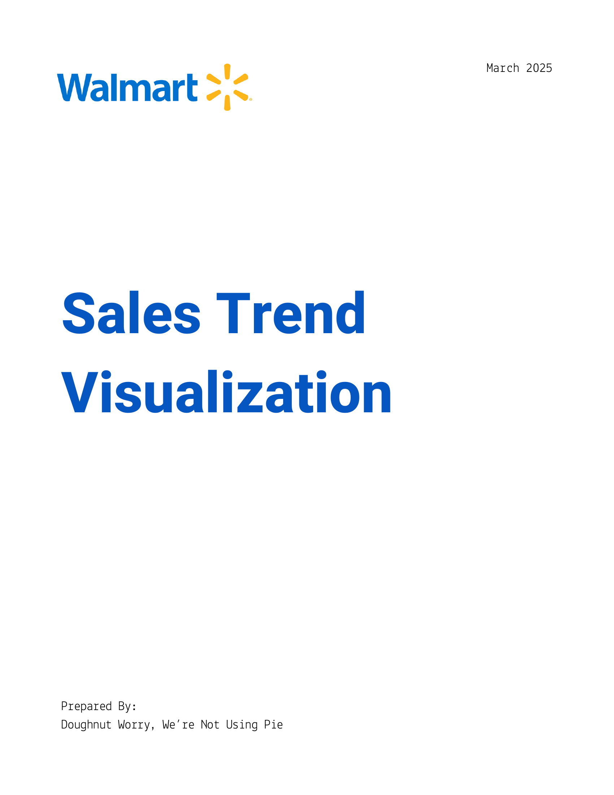
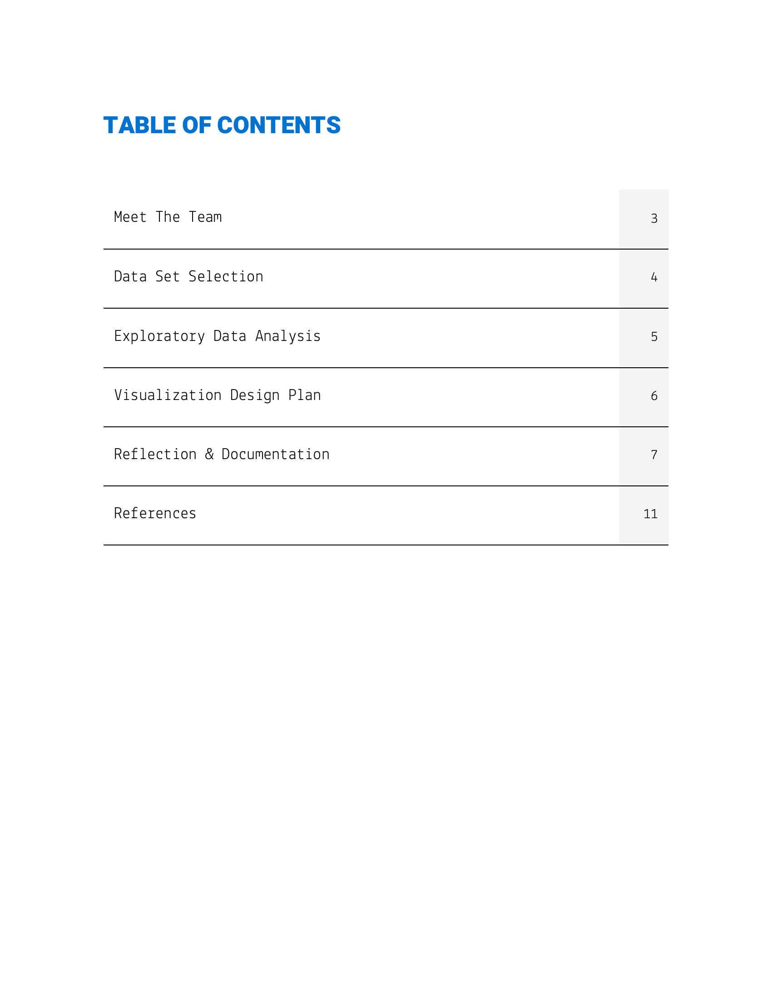
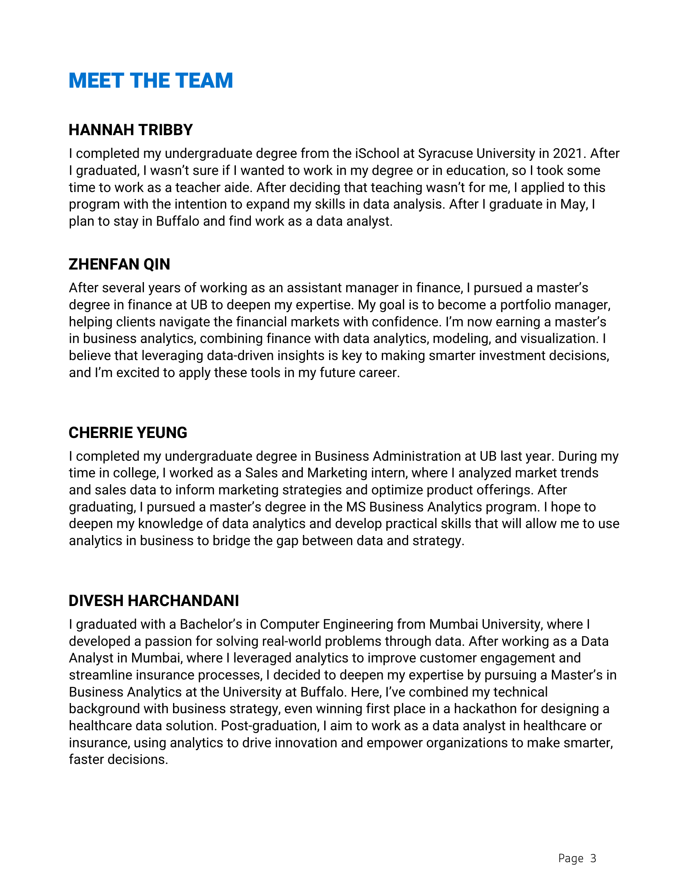
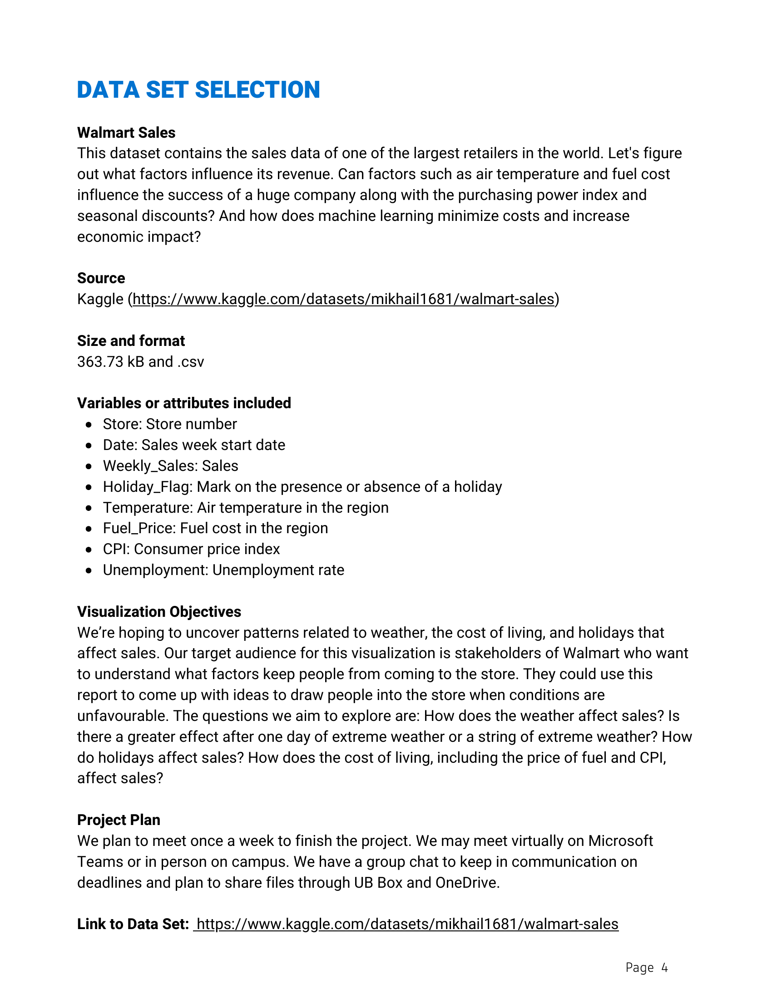
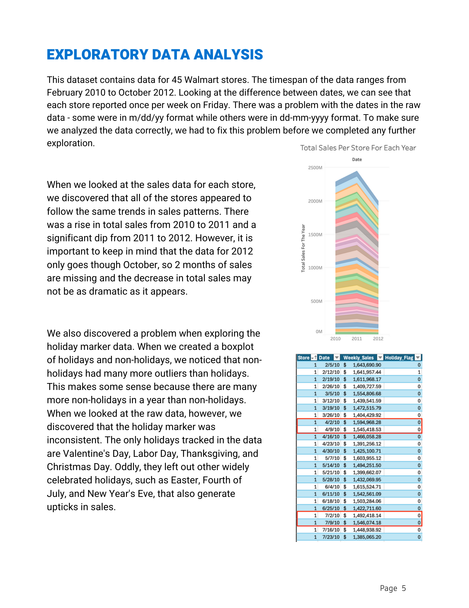
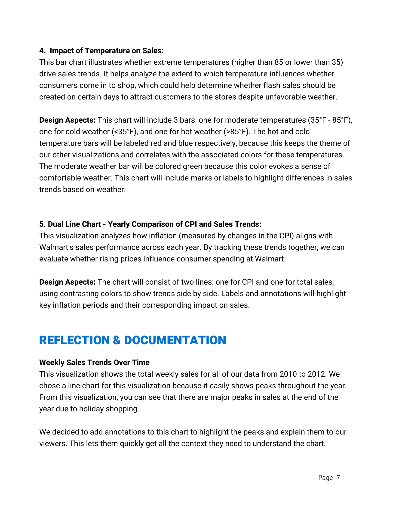
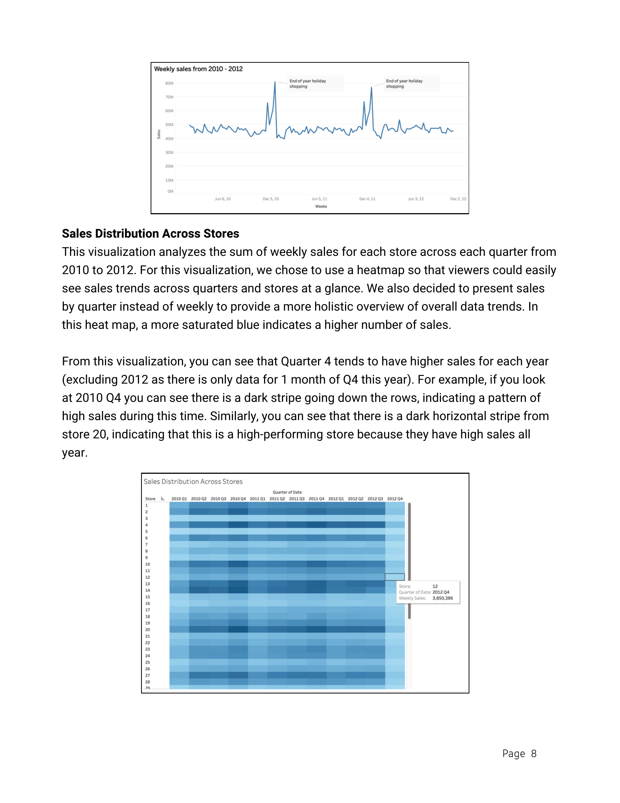
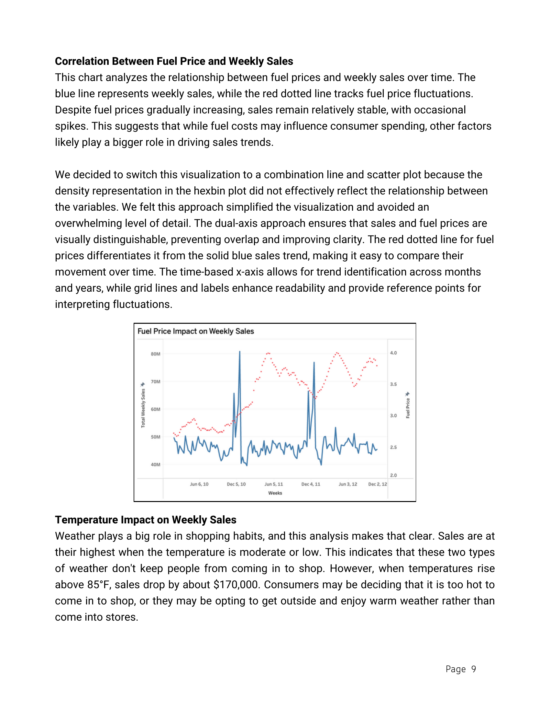
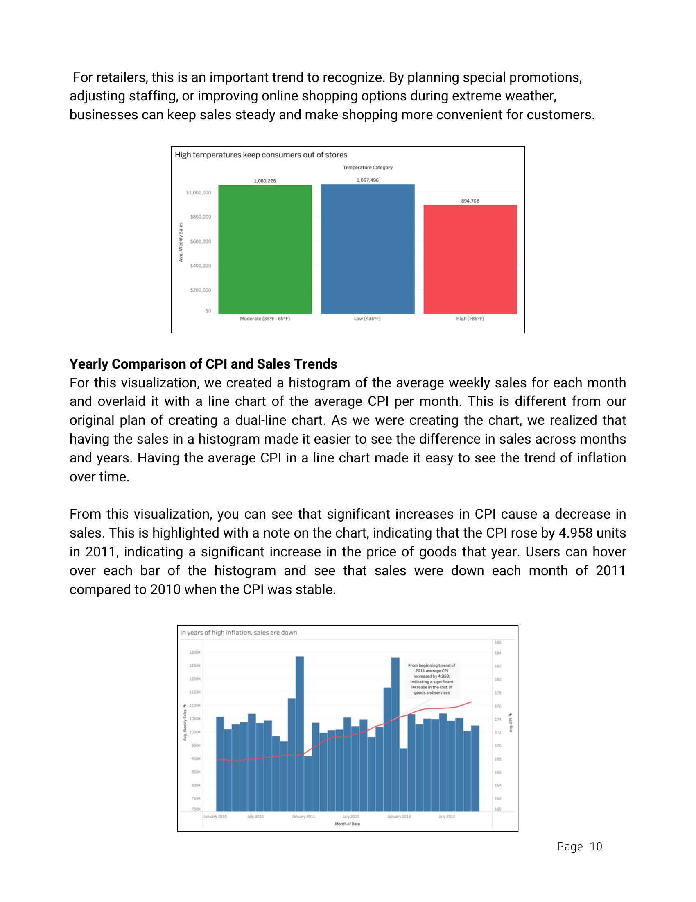
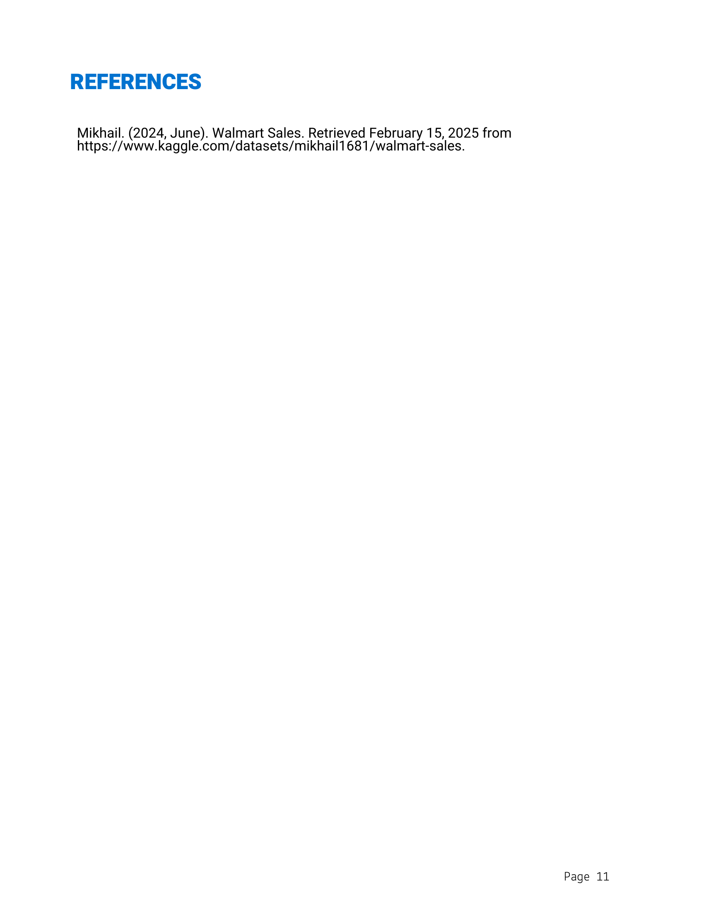

## 📊 Walmart Sales Analysis

This project explores sales data from Walmart, one of the world's largest retailers, to uncover patterns and key factors that influence revenue. 

We dive into how variables such as air temperature, fuel cost, consumer price index (CPI), unemployment rates, and seasonal holidays impact weekly sales performance across stores. The goal is to identify actionable insights and explore how machine learning can be leveraged to minimize costs and maximize economic impact.

**🔗 Dataset Source**: [Walmart Sales – Kaggle](https://www.kaggle.com/datasets/mikhail1681/walmart-sales)

---

## 📘 Business Proposal – Report Preview

Below are preview images for each page of the full report:

